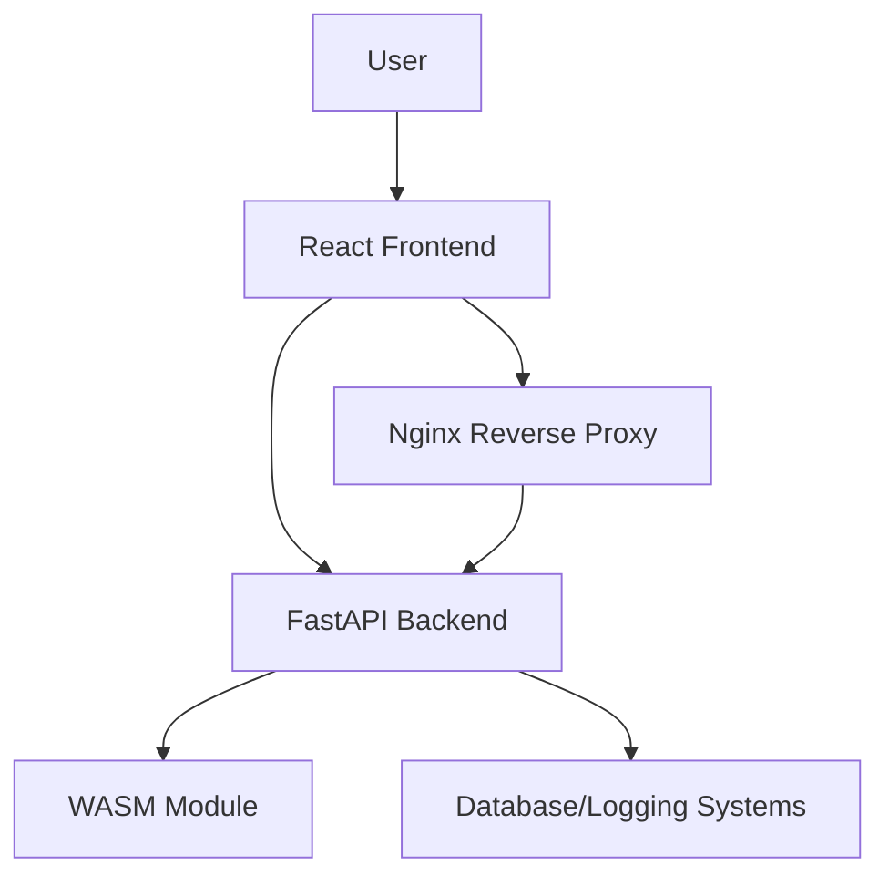

# System Architecture Overview

## Overview
The Real-Time Navigation System is composed of several components:
- **Frontend:** A React application that integrates Mapbox for map display and dynamically loads a WebAssembly (WASM) module for pathfinding.
- **Backend:** A FastAPI application serving REST API endpoints, including health checks, navigation requests, and integration points for the WASM module. It also has error monitoring via Sentry.
- **WASM Module:** A Rust-based library compiled to WebAssembly providing efficient pathfinding computations.
- **CLI:** A Python-based command line interface using Click for alternative interaction with the system.
- **Containerization:** Docker and Docker Compose are used to containerize and orchestrate services.
- **Monitoring & Deployment:** Infrastructure includes CI/CD pipelines (GitHub Actions), logging & monitoring (using Prometheus, Grafana, and Sentry), and reverse proxy configuration (Nginx) for secure production deployment.

## Component Interactions
- The **Frontend** communicates with the **Backend** via REST API calls.
- The **Backend** integrates with the **WASM Module** for performing compute-intensive tasks.
- Health checks and monitoring endpoints are exposed to ensure service uptime and performance.
- A reverse proxy (Nginx) is used to route incoming traffic, enforce HTTPS, and serve static assets.
- CI/CD pipelines automate testing, building, and deployment processes.

## Data Flow Diagram

## Deployment Considerations
- Deploy using Docker Compose with separate containers for backend, frontend, and reverse proxy.
- Ensure environment variables are properly configured via `.env` files.
- Monitor application performance and errors using centralized logging and monitoring tools.

# ...additional architectural details as needed...
